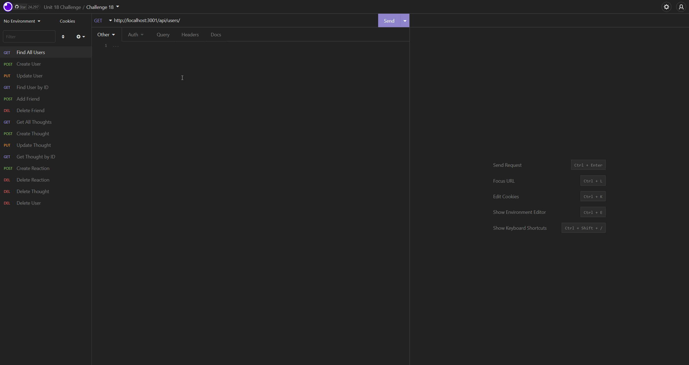

# NoSQL - Social Network API

[](http://unlicense.org/)

## Description
An API for a social network web application where users can share their thoughts, react to friends’ thoughts, and create a friend list. Application uses Express.js for routing, a MongoDB database, and the Mongoose ODM. Additionally, it uses [Express.js](https://www.npmjs.com/package/express) and [Mongoose](https://www.npmjs.com/package/mongoose) packages, as well as [Day.js](https://www.npmjs.com/package/dayjs) to format the dates for createdAt timestamps.
  
## Table of Contents
- [Installation](#installation)
- [Usage](#usage)
- [Credits](#credits)
- [License](#license)

## Installation

In order to use/view this back end site, requirements are MongoDB and node.js. To install all dependencies, run ``` npm i ``` in the terminal. 

## Usage 
To seed 3 users into the database, run ``` npm run seed ```. Then run the application with ``` npm run start ```.

---

Video walkthrough of creating and seeding the database, and starting the application


---

Video walkthrough of view and CRUD routes for User



---

Video walkthrough of view and CRUD routes for Thought


---

## Credits
While working on this project, I worked alongside Jackson Myhre in the same bootcamp class. A lot of the routes were taken from class activities and edited to work in this assignment. Other sources: 
- [Day.js Documentation](https://day.js.org/docs/en/parse/string-format)
- [AdvancedFormat dates Day.js](https://day.js.org/docs/en/plugin/loading-into-nodejs)
- [Mongoose Email Validation](https://stackoverflow.com/questions/18022365/mongoose-validate-email-syntax)

## License
Licensed by The Unlicense
